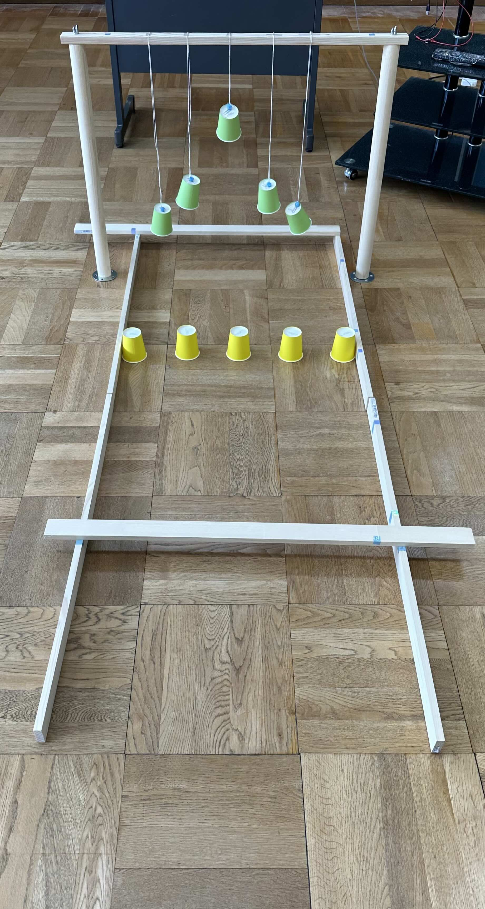

# 攻略コースについて

## コース設計の基本方針
- モーター数（2つ/3つ以上）に応じたコース設計
- 子供達の試行錯誤を促す課題設定
- タイヤの工夫で解決できる要素を含める

### 初級コース（モーター2つ）
- **ピンポン玉回収チャレンジ**
  - 難易度：★★☆☆☆
  - 想定される工夫：
    - タイヤの形状調整
    - 回収方法の工夫
  - 準備物：
    - 机や段ボールでの囲い
    - ピンポン玉

### 発展コース（モーター3つ以上）
- **紙コップ回収チャレンジ**
  - 難易度：★★★★☆
  - 想定される工夫：
    - 高所の紙コップを回収するための機構の工夫
    - 安定した走行制御
  - 準備物：
    - 紙コップ
    - コース材料

