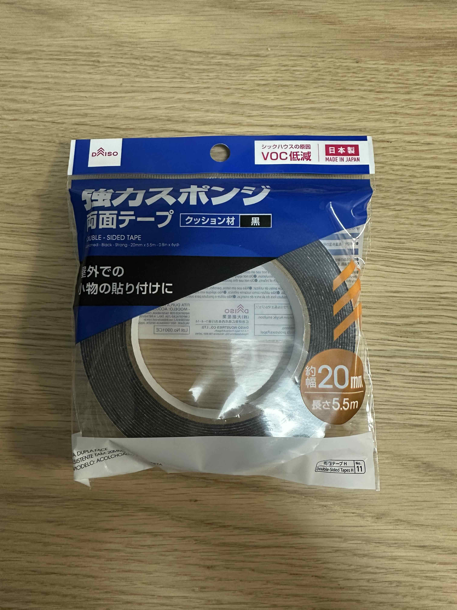
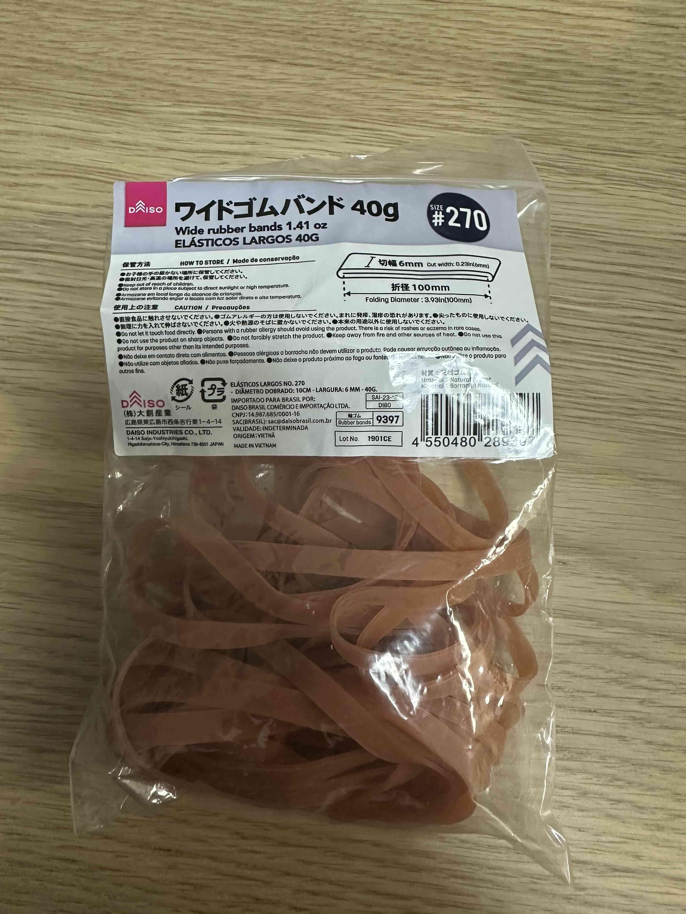
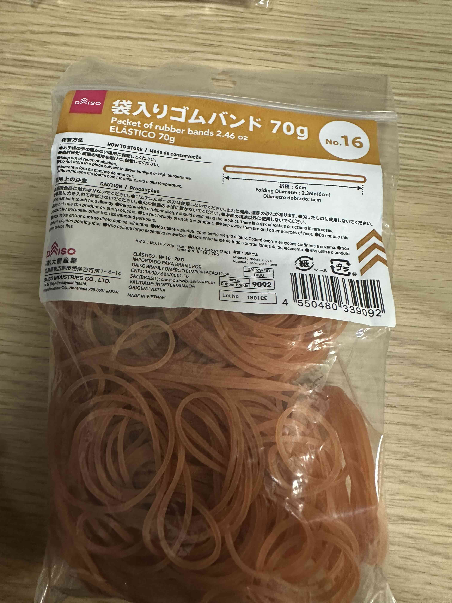
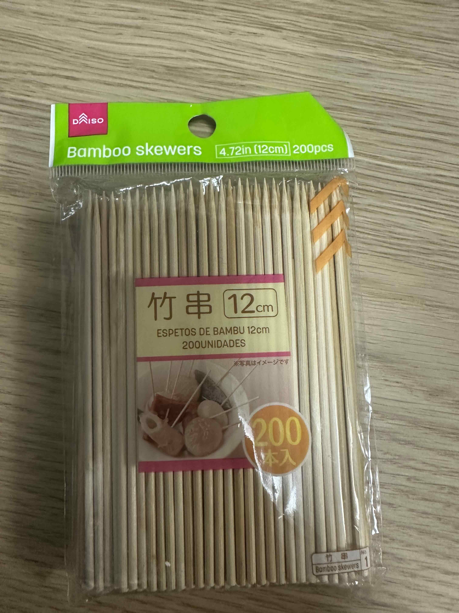
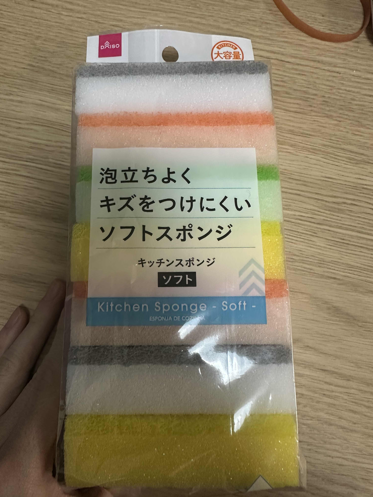
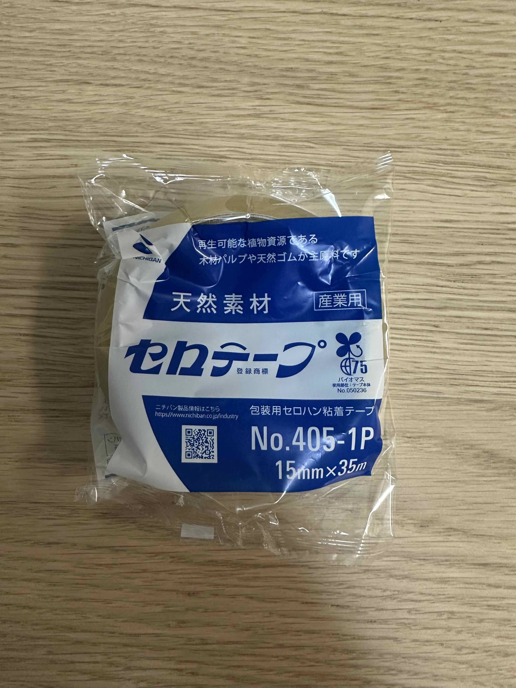
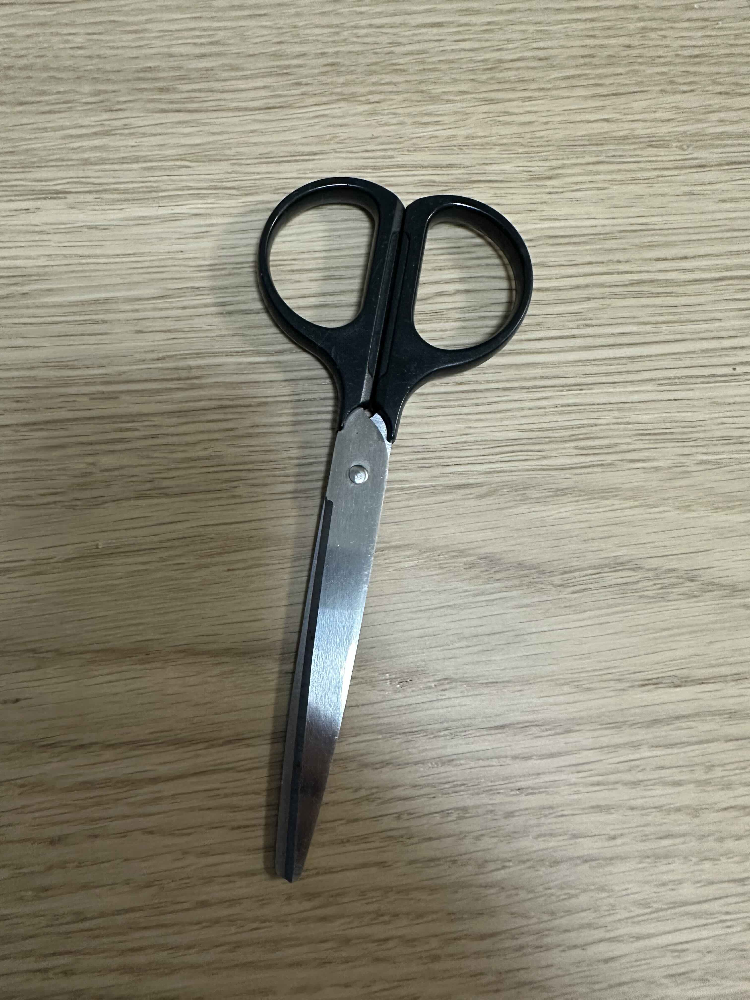
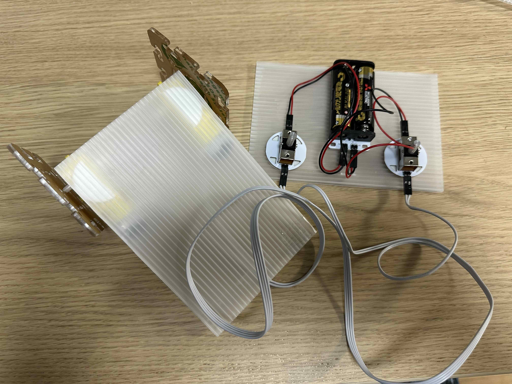
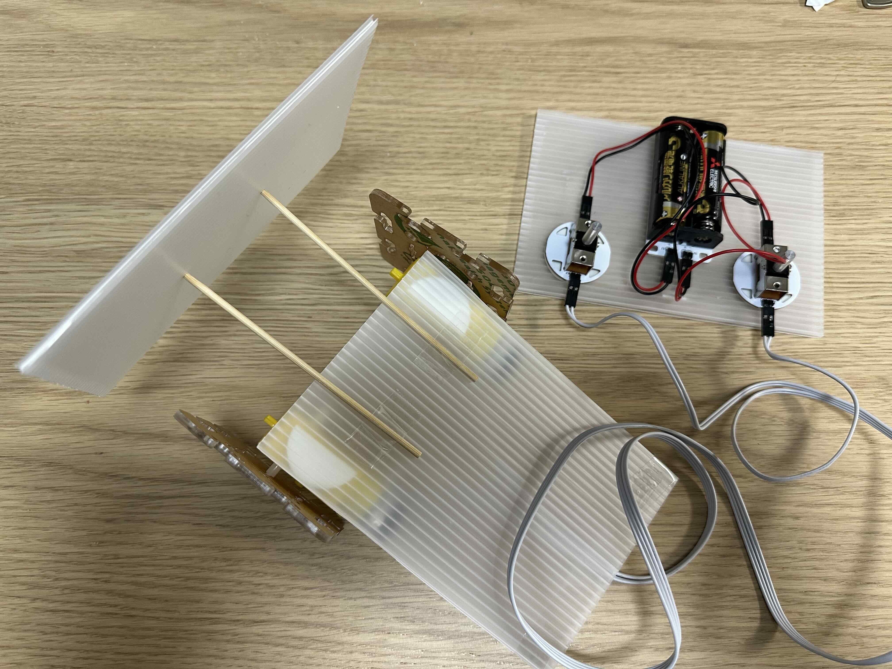
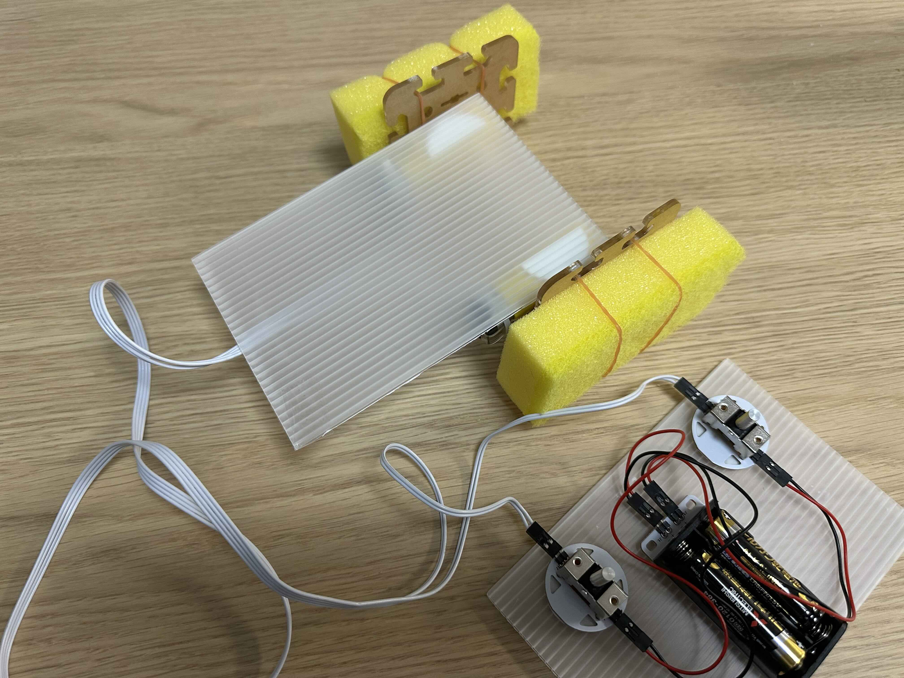

# ロボットワークショップ用キット

## 基本キット
- [ユカイな乗りものロボットキット](https://store.ux-xu.com/products/norimono-kit?variant=43159935418560&country=JP&currency=JPY&utm_medium=product_sync&utm_source=google&utm_content=sag_organic&utm_campaign=sag_organic&srsltid=AfmBOop6NbMiiRr1-_C4KdQSc0Wzx6iNoPDEoJP8qjMt_25cr6VZfH0H7v4)

- 基本ロボットの作り方は[こちら](https://note.com/kurikit/n/n620048f35245)  
いつもお世話になっています!!ありがとうございます！

## 追加材料(任意)
- 両面テープ

- 輪ゴム

- 竹串

- プラスチック段ボール

- スポンジ

- セロハンテープ

## 工具
- ハサミ

## 注意事項
- 年齢に応じた工具の使用制限
- 電池の取り扱いに注意 

## 完成例

### 基本ロボット

### 改良ロボット(例1)

※例えば、ピンポン玉を回収するロボットがテーマの場合、竹串を使ってロボットの足を作ると、ピンポン玉を回収しやすくなるなど課題に応じて決められた材料で改良してください。

### 改良ロボット(例2)

※例えば、万能ジョイントにスポンジをつけ移動をスムーズにするなど。スポンジの形状を変えることで、段差を越えることができるなど課題に応じて決められた材料で改良してください。
また、万能ジョイントを使わずにタイヤを自作できるかなど、自由な発想で試行錯誤してみましょう。

